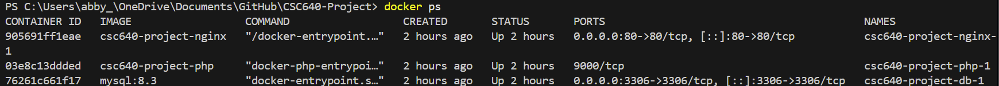
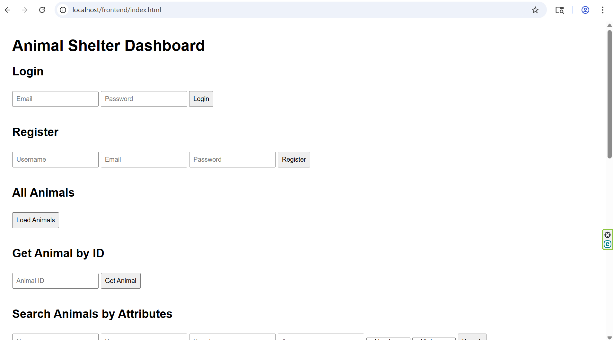

# 🐳 Start Docker and Nginx

This guide walks you through launching the CSC640 project using Docker Compose, which starts both PHP and Nginx containers.

---

## 📁 Project Setup

Make sure your project folder includes:

```
CSC640-Project/
├── compose.yaml              
├── Dockerfile.php            
├── Dockerfile.nginx          
├── .dockerignore
├── php/                      
├── nginx/
├── sql/  
```
---
## 🚀 Start the Project with Docker

Make sure Docker Desktop is running, then open a terminal in your project folder and run:

```bash
docker compose up --build
```
---
# ✅ Verify Nginx Is Running

After starting Docker, check if Nginx is active by running:

```bash
docker ps
```
If a container has a name similar to:
```
csc640-nginx
```
And a status of:
```
Up (time up)
```

Then, you have verified NGINX is running.

---
# ✅ Example of Verifying Nginx Is Running



---

# 🌐 Access the App

Once Docker is running, open your browser and go to:

### `http://localhost/frontend/index.html`

This loads the frontend served by Nginx, which communicates with the PHP backend.

---
# 🌐 Example of Accessing the App


---

# 🛑 Stopping the Project

To shut delete the CSC640 Docker containers, open your terminal in the project folder and run:

```bash
docker compose down -v
```